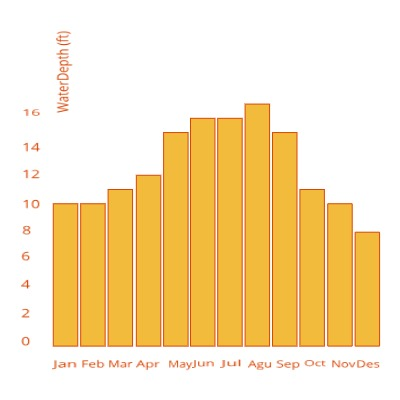

# Bar Chart with tooltips

**d3.js** | **Using d3-tip to add tooltips to a d3 bar chart.** | **Contributors:** [Majid Farahani](https://github.com/Caged)

This simple bar chart is constructed from a csv file storing the
 the depth of water ground in different month. The chart employs conventional 
 margins and a number of D3 features
 
 Bar charts provide a visual presentation of categorical data. Categorical data 
 is a grouping of data into discrete groups, such as months of the year, age group, 
 shoe sizes, and animals. These categories are usually qualitative. Bars on the 
 chart may be arranged in any order.
 

## 1\. Set up the workspace

## 2\. Data Sources
Oregon Ground water Level

## 3\. A function-by-function Tutorial

- html
- javascript
- css

#### 4\. More examples of similiar geovisualizations:
 [Bar chart by Mike Bostock](https://bl.ocks.org/mbostock/3885304)
 
 [Bar chart by Justin Palmer](http://bl.ocks.org/Caged/6476579)
 
 [d3-tipy](https://github.com/tj/d3-tipy)
 
  

credit to Justin Palmer:
[https://github.com/Caged](https://github.com/Caged)
